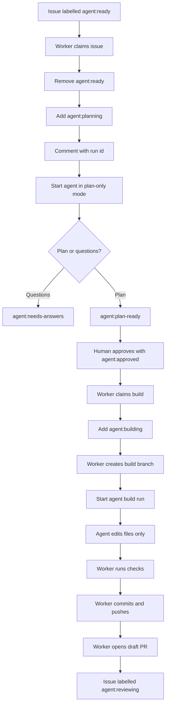

# Agent Worker Prototype

This prototype treats GitHub Issues as the queue and GitHub labels as the state machine. A Python worker claims one issue at a time, posts status comments, and starts a configurable coding agent command.

For build runs, the worker owns git and GitHub publishing. The coding agent edits files only.

The worker is intentionally small and stdlib-only so it can run on a laptop, VPS, or self-hosted runner.

## What Runs Where

```text
GitHub Issues = queue and audit log
Python worker = orchestrator, lock owner, git publisher, and PR creator
Codex/Claude CLI = file-editing coding agent
Local checkout = workspace where code changes happen
GitHub PR = review and merge surface
```

## State Flow



## Run Locally

Create a GitHub token with access to the repository, then run:

```bash
export GITHUB_TOKEN=...
python3 scripts/agent_worker.py \
  --repo spuggy/blog-starter-app \
  --workspace "$PWD" \
  --agent-cmd "codex exec" \
  --once
```

By default this is a dry run. It will read GitHub and print the actions it would take.

To actually update labels/comments and start the agent command:

```bash
python3 scripts/agent_worker.py \
  --repo spuggy/blog-starter-app \
  --workspace "$PWD" \
  --agent-cmd "codex exec" \
  --check-command "npm run build" \
  --once \
  --execute
```

For a continuous local worker:

```bash
python3 scripts/agent_worker.py \
  --repo spuggy/blog-starter-app \
  --workspace "$PWD" \
  --agent-cmd "codex exec" \
  --check-command "npm run build" \
  --poll-seconds 60 \
  --execute
```

## Parameters

| Parameter | Purpose |
| --- | --- |
| `--repo` | GitHub repository in `owner/name` form. |
| `--token-env` | Environment variable containing the GitHub token. Defaults to `GITHUB_TOKEN`. |
| `--workspace` | Local repo checkout where the agent command runs. Defaults to current directory. |
| `--agent-cmd` | Non-interactive command used to start the coding agent, such as `codex exec` or `claude --print`. |
| `--agent-timeout-seconds` | Maximum runtime for one agent process. Defaults to 3600. |
| `--base-branch` | Base branch used for build branches and PRs. Defaults to `main`. |
| `--branch-prefix` | Prefix for worker-created build branches. Defaults to `agent`. |
| `--git-remote` | Git remote used for fetch, pull, and push. Defaults to `origin`. |
| `--check-command` | Worker-owned verification command to run before commit. Repeatable. |
| `--once` | Poll once and exit. Useful for testing. |
| `--execute` | Mutate GitHub and launch the agent. Without this, the worker is dry-run only. |
| `--poll-seconds` | Delay between polls in continuous mode. |
| `--ready-label` | Queue label. Defaults to `agent:ready`. |
| `--planning-label` | Planning claim label. Defaults to `agent:planning`. |
| `--approved-label` | Build approval label. Defaults to `agent:approved`. |
| `--building-label` | Build claim label. Defaults to `agent:building`. |
| `--reviewing-label` | PR review label. Defaults to `agent:reviewing`. |

## Race Prevention

This prototype uses GitHub labels and comments as a lightweight lock:

1. Worker finds the oldest open issue labelled `agent:ready`.
2. Worker adds `agent:planning`.
3. Worker removes `agent:ready`.
4. Worker comments with a unique run id.
5. Worker refreshes the issue before launching the agent.

That is enough for a first local worker. For multiple workers on a VPS or runner fleet, add a durable lock table with:

```text
issue_number
run_id
status
locked_at
expires_at
worker_id
```

## VPS Deployment Shape

On a VPS, run the same script under `systemd`, Docker, or a process manager:

```text
VPS
  -> repo checkout
  -> GitHub token
  -> Codex/Claude CLI auth
  -> python3 scripts/agent_worker.py --execute
```

Use one workspace per active issue before allowing concurrency.

## Build Ownership

During a build run, the worker does this:

```text
1. Ensure the worktree is clean.
2. Claim the approved issue.
3. Fetch and switch to the base branch.
4. Create a branch named agent/<issue-number>-<issue-title>.
5. Start the coding agent with edit-only instructions.
6. Run any --check-command values.
7. Commit all resulting changes.
8. Push the branch.
9. Open a draft PR through the GitHub API.
10. Comment on the issue with branch, commit, and PR details.
11. Move the issue from `agent:building` to `agent:reviewing`.
```

The agent prompt explicitly says not to create branches, commit, push, or open PRs. This avoids giving the agent broad `.git` or GitHub publishing responsibility.

## Agent Command Notes

Use a non-interactive agent command. Plain `codex` starts the interactive terminal UI and may stay open after it posts a plan.

Prefer:

```bash
--agent-cmd "codex exec"
```

If you want Codex to run without asking for command approvals, put global Codex flags before `exec`:

```bash
--agent-cmd "codex --ask-for-approval never --sandbox workspace-write exec"
```

For Claude Code, prefer:

```bash
--agent-cmd "claude --print"
```
